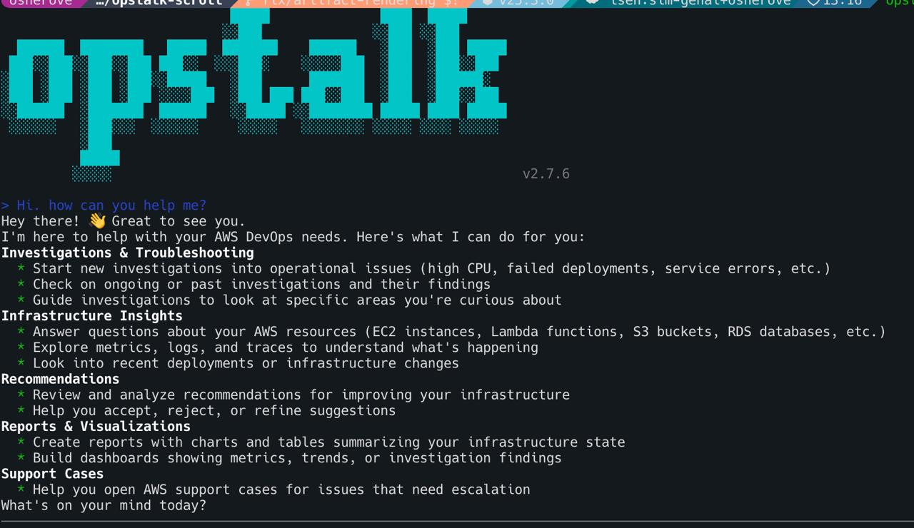

# OpsTalk

Interactive terminal chat CLI for AWS DevOps Agent.

[](https://github.com/inceptionstack/opstalk/actions/workflows/ci.yml)



```bash
npm install -g opstalk
```

## What is AWS DevOps Agent?

[AWS DevOps Agent](https://aws.amazon.com/devops-agent/) is an AI-powered service that investigates operational issues, explores your AWS infrastructure, reviews recommendations, and answers questions about your environment — all through natural conversation. It connects to your AWS account, understands your resources, and can run investigations across EC2, Lambda, CloudWatch, and more.

## Why OpsTalk?

The AWS Console is great, but sometimes you just want to talk to your infrastructure from the terminal. OpsTalk gives you a full-screen chat interface for AWS DevOps Agent right where you already work — your terminal. No browser tabs, no context switching.

- **Stay in the terminal** — investigate incidents, check resources, and review recommendations without leaving your shell
- **Script it** — use `opstalk send "any critical issues?"` in cron jobs, runbooks, or CI pipelines
- **Stream responses** — watch the agent think and work in real time with tool call visibility
- **Resume conversations** — pick up where you left off with persistent chat history

## Features

- Interactive full-screen TUI chat with streaming responses
- Mermaid diagram rendering — auto-generates HTML with dark theme, clickable file links in terminal
- Markdown rendering with tables (box-drawing), bold, italic, code blocks, and lists
- Artifact rendering — create_artifact content (diagrams, ASCII art) displayed inline
- Slash commands for chat control, help, clearing the transcript, starting a new chat, and resuming previous chats
- Setup wizard for agent space selection on first launch
- One-shot `send` command for scripting and automation
- List previous chat sessions and resume them from the interactive picker
- List available AWS DevOps Agent spaces
- AWS IAM SigV4 authentication using the standard AWS credential chain
- XDG-compliant config storage with restrictive `0600` permissions

## Prerequisites

- Node.js `>= 20`
- AWS credentials configured through one of the standard mechanisms:
  - instance profile
  - environment variables
  - AWS IAM Identity Center / SSO
  - shared AWS config and credentials files
- Access to the AWS DevOps Agent service and at least one agent space

## Installation

### Install from source

```bash
git clone https://github.com/inceptionstack/opstalk.git
cd opstalk
npm install
npm run build
npm link
```

`npm link` is optional. It makes the `opstalk` command available globally on your machine.

## Configuration

OpsTalk stores its config at:

```text
~/.config/opstalk/config.json
```

If `XDG_CONFIG_HOME` is set, OpsTalk uses `$XDG_CONFIG_HOME/opstalk/config.json` instead.

Example config:

```json
{
  "region": "us-east-1",
  "agentSpaceId": "as-1234567890abcdef",
  "userId": "alice@example.com",
  "userType": "IAM",
  "ui": {
    "thinkingMode": "off"
  }
}
```

Environment variable overrides:

- `OPSTALK_REGION`
- `OPSTALK_AGENT_SPACE_ID`
- `OPSTALK_USER_ID`

CLI flag overrides:

- `--region`
- `--agent-space-id`
- `--user-id`

In practice, command-line flags override environment variables, and environment variables override the persisted config file.

## Usage

Launch the interactive chat UI:

```bash
opstalk
```

Send a one-shot message, stream the response, and exit:

```bash
opstalk send "what is happening?"
```

List recent chat sessions for the current agent space and user:

```bash
opstalk chats
```

List available agent spaces:

```bash
opstalk spaces
```

You can also pass overrides per command:

```bash
opstalk --region us-west-2 --agent-space-id as-123 --user-id alice
opstalk send "summarize current incidents" --region us-west-2
```

### Interactive Slash Commands

| Command | Description |
| --- | --- |
| `/help` | Show available slash commands |
| `/clear` | Clear the current transcript view |
| `/new` | Create a new chat |
| `/chats` | Open the recent chat picker and resume a previous chat |
| `/quit` | Exit OpsTalk |
| `/exit` | Exit OpsTalk |

When the chat picker is open, use the arrow keys to move through chats, `Enter` to resume one, and `Esc` to close the picker.

## Project Structure

```text
src/
├── agent/      AWS DevOps Agent client, SigV4 signing, stream parsing, shared API types
├── cli/        Commander entrypoint and subcommands (`chat`, `send`, `chats`, `spaces`)
├── config/     XDG config paths, load/save helpers, config merging
└── tui/        Ink/React application, screens, hooks, components, markdown rendering
```

## Development

Build the project:

```bash
npm run build
```

Run typechecking:

```bash
npm run typecheck
```

Run tests:

```bash
npm test
```

Run directly from source without building:

```bash
npx tsx src/cli/cli.ts
```

## Tech Stack

- TypeScript
- Ink v6
- React 19
- Commander
- marked + marked-terminal (markdown rendering)
- AWS SDK SigV4 signing via Smithy and AWS credential providers
- `@smithy/eventstream-serde-node` for streaming response parsing

## For AI Agents

If you are an AI agent working on this repo:

1. Install dependencies with `npm install`.
2. Run the CLI with `npx tsx src/cli/cli.ts` during development or `npm run build` followed by `node dist/cli/cli.js`.
3. Start by reading these files to understand the shape of the codebase:
   - `DESIGN-BRIEF.md`
   - `src/agent/client.ts`
   - `src/tui/lib/types.ts`

To extend OpsTalk:

- Add new CLI commands in `src/cli/commands/`
- Add or revise Ink screens in `src/tui/screens/`
- Modify the AWS DevOps Agent client and streaming logic in `src/agent/`

## Contributing

Fork the repo, create a branch, make your change, and open a pull request against `main`. Keep changes focused, follow the existing ESM + strict TypeScript setup, and make sure build, typecheck, and test steps pass before submitting.

## License

See `LICENSE`.

## Changelog

| Version | Date | Description |
| --- | --- | --- |
| **v2.7.0** | 2026-04-11 | Mermaid diagrams — auto-generates self-contained HTML with dark theme, Copy Source button, SHA1 cache dedup |
| **v2.6.0** | 2026-04-11 | Parse concatenated JSON in tool_summary buffers; extract artifact content from nested `artifact.elements` |
| **v2.5.0** | 2026-04-10 | Replace custom markdown with `marked` + `marked-terminal` — proper tables, headers, code blocks |
| **v2.4.0** | 2026-04-10 | Markdown tables with aligned columns and box-drawing characters |
| **v2.3.0** | 2026-04-10 | OpsTalk ASCII banner with version on startup |
| **v2.2.0** | 2026-04-10 | Scrollable viewport with `<Static>`, artifact/diagram rendering, tool call JSON buffering |
| **v2.1.0** | 2026-04-10 | Revert to stable fixed-viewport base after scroll rewrite conflicts |
| **v2.0.0** | 2026-04-10 | Replace Ink chat with Node.js readline — fixes input/streaming positioning; Ink kept for setup only |
| **v1.2.0** | 2026-04-10 | Format tool_call/tool_result with icons; skip duplicate `final_response` blocks |
| **v1.1.0** | 2026-04-10 | `--debug` flag with detailed logging; fix viewport layout collapse |
| **v1.0.0** | 2026-04-10 | First stable release — full Ink TUI, SigV4 auth, streaming, slash commands, chat resume, `send` command |
